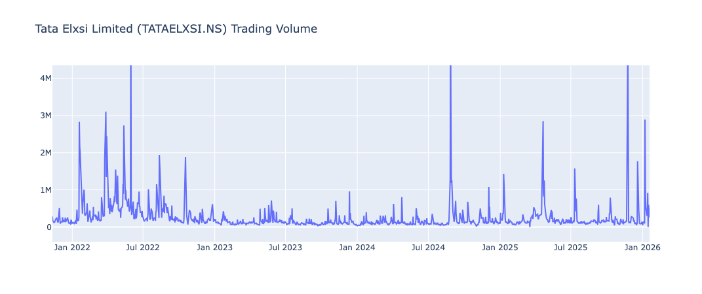
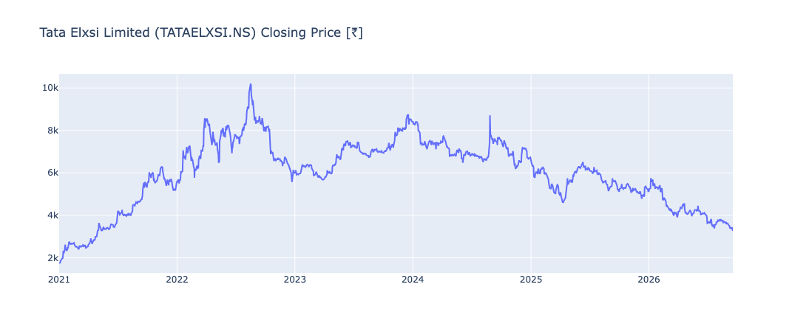
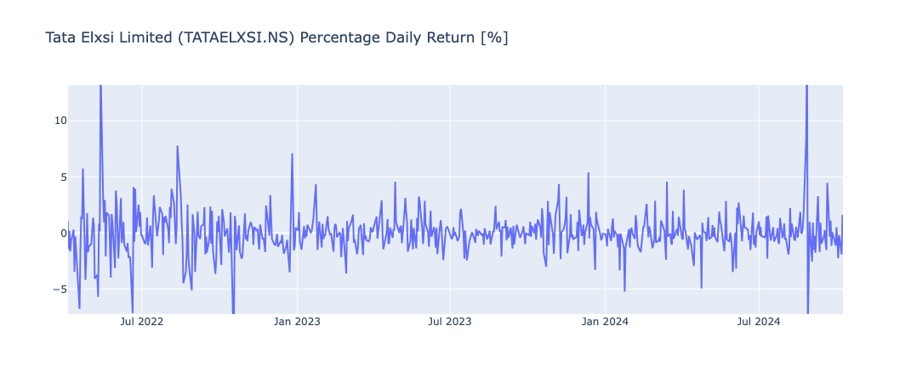
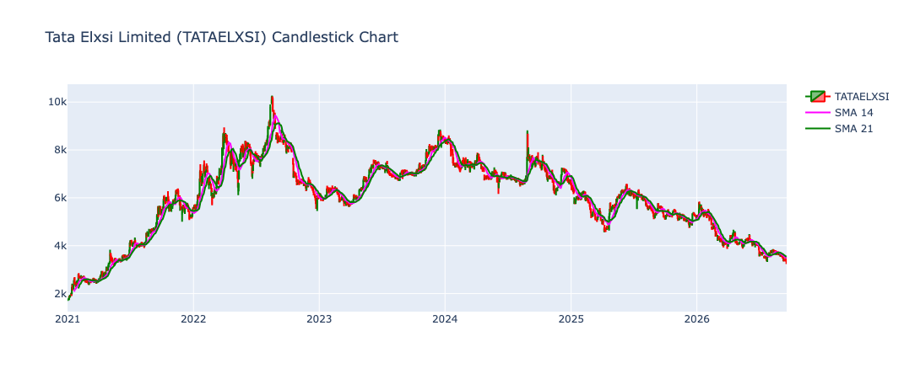
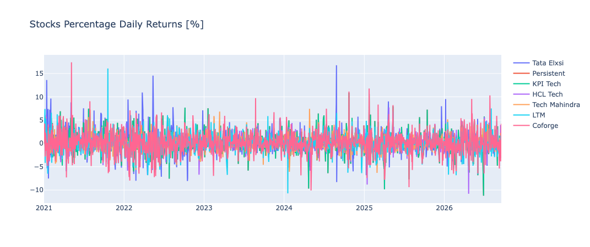
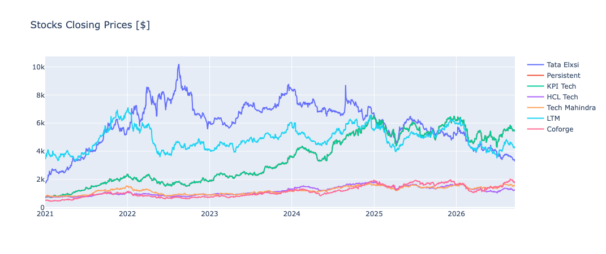
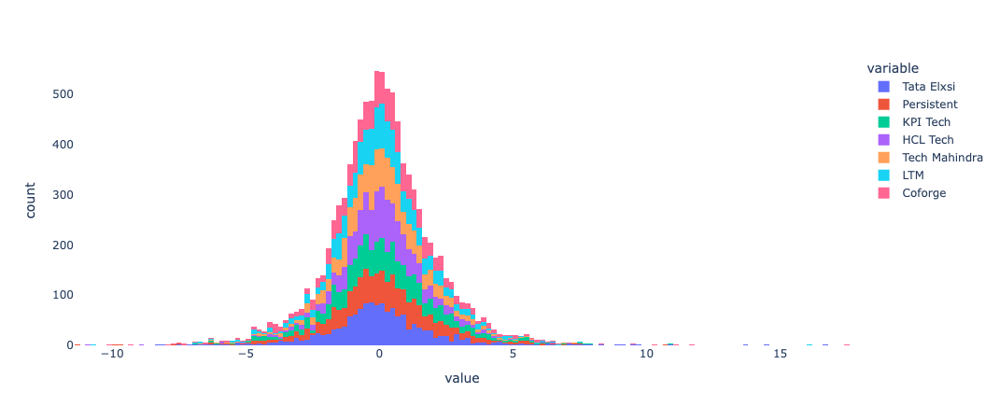

# Stock Visualization & Exploratory Analysis

## Overview

This project is a **stock market visualization and exploratory data analysis project built in Python**.

I started with **Tata Elxsi (TATAELXSI.NS)** as the main stock and then extended the analysis to a group of other stocks to understand how different stocks behave and move in relation to each other.

The main purpose of this project was not to predict stock prices. Instead, I wanted to learn how to take raw market data, clean it, calculate useful financial measures, and turn it into visual insights.

### The main questions I explored

- How has Tata Elxsi's stock price moved over time?
- How does trading volume behave during different periods?
- What does the daily return distribution look like?
- How can moving averages help identify price trends?
- How do the selected stocks compare with each other?
- How closely are their daily returns related?
- Why is it better to compare normalized prices and returns instead of only looking at absolute prices?

---

## Tools & Libraries

The project uses Python and the following libraries:

- **Pandas** – data cleaning, transformation, and analysis
- **NumPy** – numerical calculations
- **yfinance** – retrieving Tata Elxsi historical market data
- **Matplotlib** – basic data visualization
- **Seaborn** – statistical visualizations such as correlation heatmaps and pair plots
- **Plotly** – interactive financial charts
- **Cufflinks** – financial charting
- **nbformat** – notebook compatibility

---

## Project Structure

The repository is organized as follows:

```text
Stock-Visualization_Tata-Elxsi/
│
├── graphs/
│   ├── Distribution_daily_stocks_returns.png
│   ├── Multi_Stocks_Closing_Prices.png
│   ├── Stocks_Percentage_Daily_Returns.png
│   ├── tata_elxsi_daily_candlestick_chart.png
│   ├── tata_elxsi_daily_return.png
│   ├── tata_elxsi_stock_price.png
│   └── tata_elxsi_volume.png
│
├── Stock Visualization.ipynb
├── Stock Visualization.py
└── Stocks.ipynb
```

The `graphs` folder contains the final visual outputs, while the Python script and notebooks contain the analysis workflow.

---

# My Approach

I followed a step-by-step approach rather than jumping directly into visualization.

## 1. Start with Tata Elxsi

I first downloaded historical Tata Elxsi data using Yahoo Finance through `yfinance`.

The analysis uses data from:

**1 January 2021 to 21 September 2026**

The dataset contains market information such as:

- Open
- High
- Low
- Close
- Volume

I then checked the dataset structure and missing values before continuing with the analysis.

---

## 2. Clean the Data

The first thing I learned was that **data needs to be understood before it can be analyzed**.

I removed fields that were not required for this analysis, such as:

- Dividends
- Stock Splits

I also checked for null values and reviewed the dataframe structure using Pandas.

This made the dataset easier to work with for the next steps.

---

## 3. Calculate Daily Returns

To understand daily stock movements, I calculated the percentage daily return:

```text
Daily Return =
((Today's Closing Price / Yesterday's Closing Price) - 1) × 100
```

This was an important step because the absolute stock price tells us where the stock is trading, but the daily return tells us **how much the stock moved from one day to the next**.

---

# Tata Elxsi Analysis

## 4. Closing Price

The closing-price chart shows the long-term movement of Tata Elxsi from 2021 through 2026.

The chart shows a strong upward phase during 2021 and 2022, followed by multiple periods of correction, recovery, and decline.

One important observation is that a stock can experience a large increase over several years while still going through significant short-term drawdowns.

### What I learned

Looking at the historical price helps me understand the broad trend, but it does not tell me the whole story about risk or volatility.

---

## 5. Trading Volume

The trading-volume chart shows that most days have comparatively lower trading activity, while some days have very large spikes.

These spikes indicate periods when trading activity was much higher than normal.

However, a volume spike by itself does not explain whether the stock will rise or fall. It only tells us that **market participation was unusually high**.

### What I learned

Volume becomes much more meaningful when it is analyzed together with price movements and returns.

---

## 6. Daily Returns

The daily-return chart is concentrated around zero, with occasional large positive and negative movements.

This tells me that most daily price changes are relatively small, while a smaller number of observations represent much larger movements.

Those extreme movements are important because they influence how we think about volatility and risk.

### What I learned

For risk analysis, percentage returns are generally much more useful than simply looking at the stock's price level.

---

## 7. Candlestick Chart

The candlestick chart provides more information than a simple line chart because each candle contains:

- Open price
- High price
- Low price
- Close price

I also added:

- **SMA 14** – 14-day Simple Moving Average
- **SMA 21** – 21-day Simple Moving Average

The moving averages smooth some of the daily noise and make short-term trends easier to observe.

### What I learned

Moving averages can help visualize trends, but they are **lagging indicators** and should not be treated as standalone trading signals.

---

## 8. Daily Return Classification

I also created a simple classification system for Tata Elxsi's daily returns.

The categories include:

- Insignificant Change
- Positive Change
- Negative Change
- Large Positive Change
- Large Negative Change
- Bull Run
- Bear Sell Off

The purpose was to turn raw percentage returns into categories that are easier to interpret and summarize.

### What I learned

Transforming numerical data into meaningful categories can make exploratory analysis easier to communicate, especially when explaining the results to someone who is not working directly with the raw dataset.

---

# Multi-Stock Analysis

After exploring Tata Elxsi individually, I expanded the analysis to multiple stocks.

The comparison includes:

- Tata Elxsi
- Persistent
- KPIT Tech
- HCL Tech
- Tech Mahindra
- LTM
- Coforge

This helped me move from **single-stock analysis to comparative analysis**.

---

## 9. Comparing Closing Prices

The multi-stock closing-price chart shows that the selected stocks trade at very different nominal price levels.

Because of this, simply comparing their raw prices can be misleading.

For example, a stock trading at ₹6,000 is not automatically performing better than a stock trading at ₹1,500.

### What I learned

**Price level and investment performance are not the same thing.**

That is why returns and normalized prices are more useful for comparing different stocks.

---

## 10. Comparing Daily Returns

The multi-stock daily-return chart shows that all the stocks experience movements around zero, but the size and frequency of extreme movements differ.

There are also periods where several stocks experience larger movements around the same time.

### What I learned

Different companies can have different individual price behaviour while still being affected by broader market or sector conditions.

This is an important idea when thinking about diversification.

---

## 11. Distribution of Daily Returns

The return distribution is heavily concentrated around zero, with fewer observations appearing farther away from the center.

Those observations in the tails represent relatively large daily movements.

### What I learned

Financial returns are not always small and stable. A relatively small number of extreme observations can have an important effect on measures of risk and volatility.

---

## 12. Correlation Heatmap

The correlation analysis looks at how the daily returns of the selected stocks move relative to each other.

A positive correlation means that two stocks tend to move in the same direction, while a lower correlation indicates that their daily movements are less closely related.

### What I learned

Correlation is useful when thinking about diversification, but it should not be treated as a permanent number. Relationships between stocks can change over time.

Correlation also does not establish that one stock causes another stock to move.

---

## 13. Pair Plot

The pair plot provides a visual way to compare the daily returns of the stocks.

It helps identify:

- Relationships between returns
- Clusters around the average
- Potential outliers
- The general shape of the return distributions

### What I learned

Sometimes a visual relationship is easier to identify from several plots together than from a single correlation number.

---

## 14. Price Scaling

I also created a simple price-scaling function that divides each stock's price by its starting price.

This puts all stocks on a common starting point.

Conceptually:

```text
Scaled Price = Current Price / Starting Price
```

This makes it easier to compare **relative performance** instead of absolute price levels.

### What I learned

Normalization is extremely useful when comparing assets that begin at very different price levels.

---

# Key Lessons From the Project

The biggest learning from this project was not a particular Python function. It was learning how to think about financial data.

### 1. Start with the data

Before making charts, I need to understand the columns, check missing values, and make sure the data is in the right format.

### 2. Use the right metric for the question

Different questions need different measures:

- **Price** → long-term price movement
- **Volume** → trading activity
- **Daily return** → daily performance
- **Moving average** → smoothed trend
- **Correlation** → relationship between returns
- **Scaled price** → relative performance comparison

### 3. Visualization is part of analysis

Charts are not just for presentation.

They helped me identify trends, spikes, volatility, extreme movements, and relationships that were harder to see from raw numbers.

### 4. Price is not the same as return

A stock with a higher share price does not automatically have better performance.

Returns provide a much better basis for comparing movements across different stocks.

### 5. Extreme observations matter

Most daily returns are relatively small, but the occasional large movement can have a significant effect on risk measures.

### 6. Correlation does not mean causation

Two stocks moving together does not mean that one stock is causing the other to move.

The relationship may be influenced by common market, industry, or economic factors.

### 7. Financial analysis needs context

A chart can show **what happened**, but it does not necessarily explain **why it happened**.

Understanding the reasons behind major price or volume movements would require additional information such as company announcements, earnings, industry developments, and broader market events.

---

# What I Would Build Next

This project gave me a foundation in financial data analysis and visualization. The natural next step would be to extend it into a broader portfolio-analysis project.

Some of the improvements I would like to add are:

- Annualized return
- Annualized volatility
- Sharpe ratio
- Beta
- Maximum drawdown
- Rolling volatility
- Rolling correlation
- Benchmark comparison
- Portfolio construction
- Portfolio optimization
- Monte Carlo simulation
- Interactive dashboard
- Fundamental analysis

This would connect the data-visualization work with **portfolio management, risk analysis, and financial modelling**.

---

# How to Run the Project

## 1. Clone the repository

```bash
git clone https://github.com/ayantikpandit/Stock-Visualization_Tata-Elxsi.git
cd Stock-Visualization_Tata-Elxsi
```

## 2. Install the required libraries

```bash
pip install pandas numpy matplotlib seaborn plotly yfinance cufflinks jupyter nbformat
```

## 3. Run the Python script

```bash
python "Stock Visualization.py"
```

## 4. Or open the notebooks

```bash
jupyter notebook
```

Then open:

```text
Stock Visualization.ipynb
Stocks.ipynb
```

> **Note:** The multi-stock section of the Python workflow reads a CSV dataset using `pd.read_csv()`. Make sure the corresponding CSV file/data source is available in your local working directory if you want to reproduce that section directly from the script.

---

# Visualizations

## Tata Elxsi – Trading Volume



## Tata Elxsi – Closing Price



## Tata Elxsi – Daily Returns



## Tata Elxsi – Candlestick Chart



## Multi-Stock Daily Returns



## Multi-Stock Closing Prices



## Distribution of Daily Returns



---

# Disclaimer

This project is intended for **educational and analytical purposes only**.

The visualizations and observations are based on historical market data and should not be considered investment advice or a forecast of future stock performance.

---

# Author

**Ayantik Pandit**

Finance Student | Financial Analysis | Python | Data Visualization

### Connect with me

[LinkedIn – Ayantik Pandit](https://www.linkedin.com/in/ayantik-pandit/)

---

## Final Takeaway

I built this project to understand how raw stock-market data can be transformed into meaningful financial insights.

The biggest thing I learned was that good financial analysis is not about creating the most charts. It is about asking the right question, selecting the right metric, and then using the visualization to understand the data.

This project gave me practical experience with **data collection, data cleaning, return calculation, exploratory analysis, financial visualization, comparative stock analysis, correlation, and basic quantitative thinking**.

It also gave me a better understanding of how Python can be used as a practical tool in finance rather than just as a programming language.
